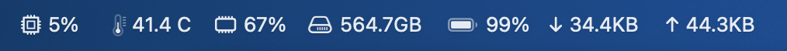
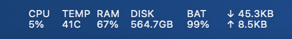
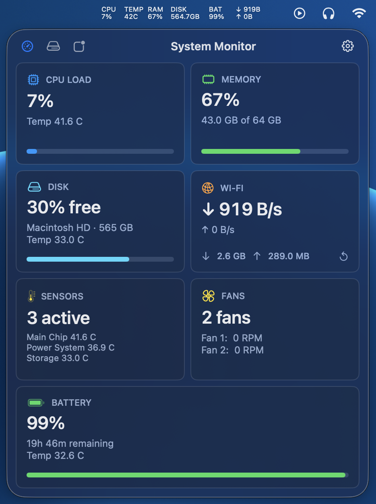
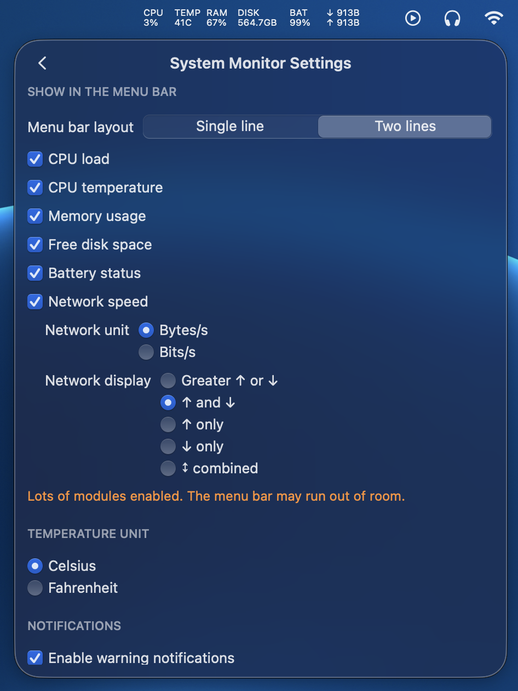
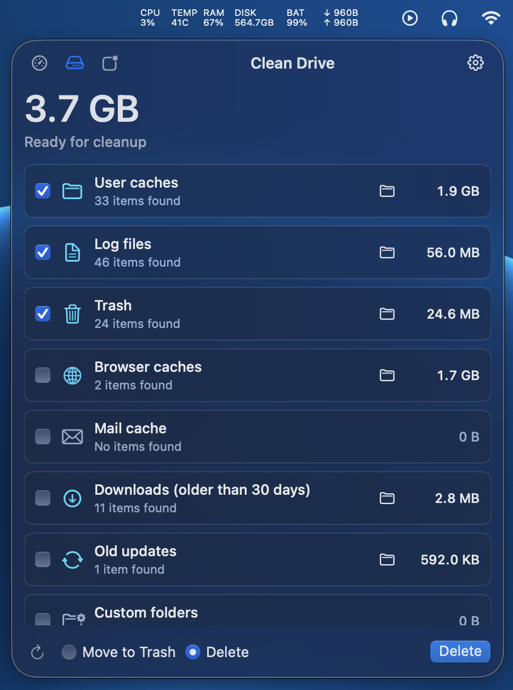
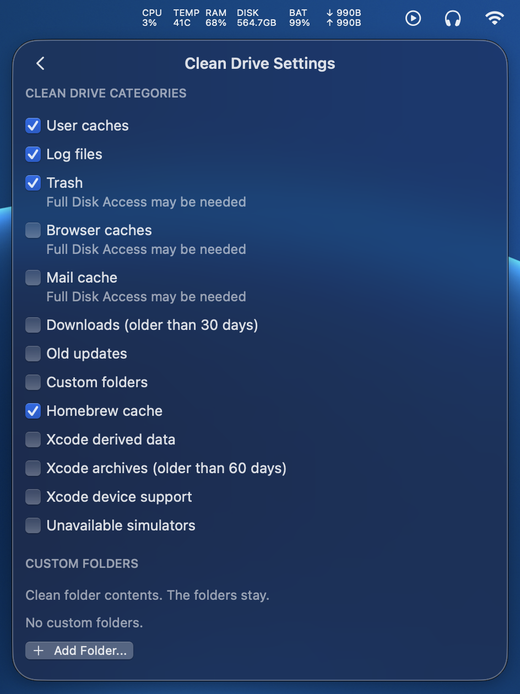
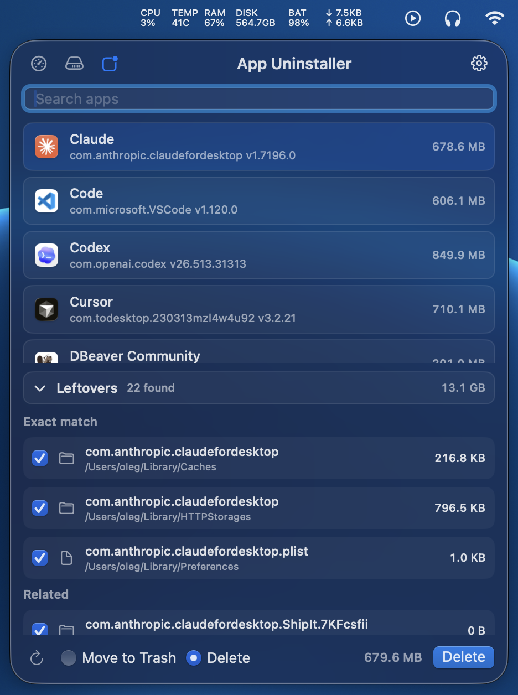
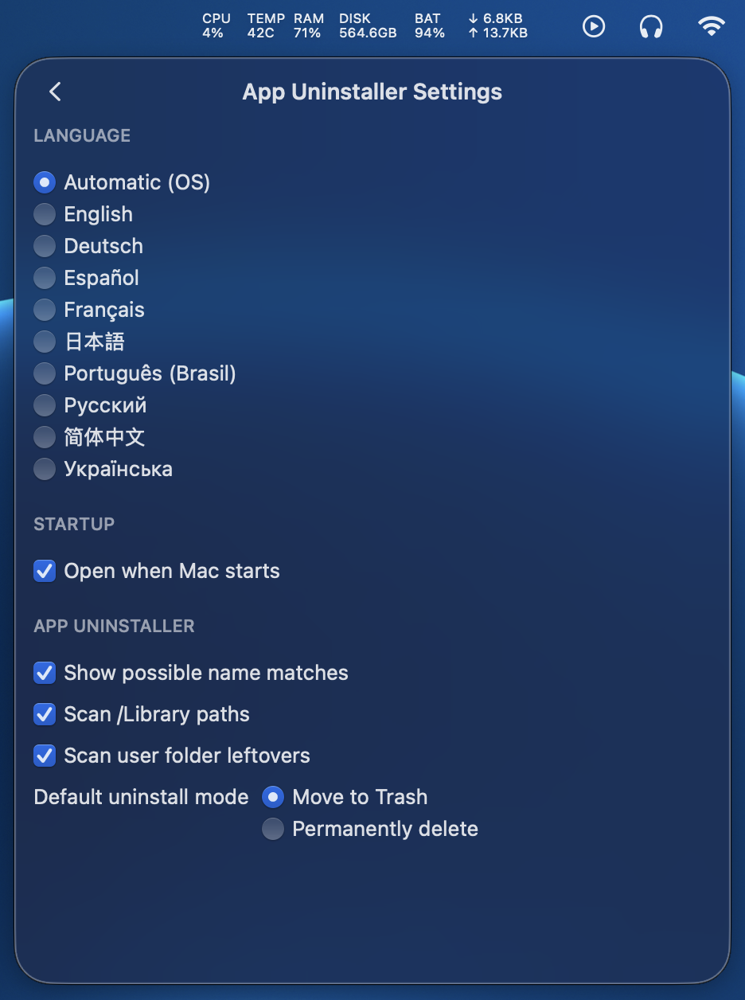

# System Utilities for macOS

Native macOS menu bar app for system metrics and safe disk cleanup.

The app runs without a Dock icon. It shows compact live metrics in the menu bar
and opens a SwiftUI popover for the dashboard, Clean Drive, App Uninstaller,
and preferences.

<p>
  
</p>

<p>
  
</p>

## Requirements

**To run the app:**
- macOS 14 or newer

**To build from source:**
- macOS 14 or newer
- Swift 6 toolchain
- Xcode command line tools

## Releases

[Download it here](https://github.com/olegasd123/system-utilities-macos/tags)

## Features

### System Monitor

<p align="center">
  
  
</p>

- Live CPU, memory, disk, network, battery, temperature, and fan metrics.
- One-second metric refresh.
- Single-line and two-line menu bar layouts.
- Menu bar options for CPU load, CPU temperature, memory use, free disk space,
  battery status, and network speed.
- Network display modes for the greater value, upload and download, upload
  only, download only, or combined traffic.
- Network units in bytes per second or bits per second.
- Daily network totals with a reset button.
- Temperature display in Celsius or Fahrenheit.
- JSON settings stored in Application Support.
- Warning notifications for CPU, memory, disk, battery, and temperature.
- Launch at login through `SMAppService`.
- Apple Silicon temperatures through `IOHIDEventSystemClient`.
- Intel temperatures and fan RPM through AppleSMC.

### Clean Drive

<p align="center">
  
  
</p>

- Reclaimable-space scan in a popover tab.
- Safe cleanup by default: files move to Trash.
- Optional permanent delete mode with confirmation.
- Preview sheet for files found in each category.
- User caches, logs, Trash, custom folders, Homebrew cache, browser caches,
  Mail downloads, old downloads, old software updates, and Xcode data.
- Xcode cleanup for derived data, old archives, device support, unavailable
  simulators, and simulator caches.
- Full Disk Access callout for protected categories.
- Cleanup reminders when reclaimable space is above the configured threshold.
- Per-category settings, reminder settings, and age thresholds for downloads
  and Xcode archives.

### App Uninstaller

<p align="center">
  
  
</p>

- Installed-app list from `/Applications`, `/Applications/Utilities`, and
  `~/Applications`.
- Leftover scan for related files in `~/Library` and best-effort `/Library`
  paths.
- Conservative matching by bundle ID by default, with optional name matches.
- Optional user-folder scan for known app-owned dotfiles and folders.
- Uninstall by moving the app and selected leftovers to Trash by default.
- Optional permanent delete mode with confirmation.
- Running apps are asked to quit before removal.

## Run

```bash
swift run SystemMonitor
```

Click the menu bar item to open the popover. Use the tab icons to switch
between System Monitor, Clean Drive, and App Uninstaller. Right-click the menu
bar item to open the app menu.

Notification delivery and launch at login need a packaged `.app` bundle. They
are disabled when the app runs as a raw SwiftPM executable.

## Test

Run the test suite:

```bash
swift test
```

## Build An App Bundle

Build a local `.app` bundle:

```bash
scripts/build_app.sh
```

This creates an ad-hoc signed app at `dist/System Monitor.app`. The version is
read from `VERSION`. Use this build for local checks and direct sharing.

Build a debug bundle:

```bash
CONFIGURATION=debug scripts/build_app.sh
```

Use another app icon:

```bash
APP_ICON_PATH="/path/to/AppIcon.icns" scripts/build_app.sh
```

Build with a Developer ID certificate:

```bash
SIGN_IDENTITY="Developer ID Application: Your Name (TEAMID)" scripts/build_app.sh
```

Create a DMG after the app is built:

```bash
scripts/make_dmg.sh
```

Build with Sparkle update settings:

```bash
SPARKLE_FEED_URL="https://github.com/OWNER/REPO/releases/latest/download/appcast.xml" \
SPARKLE_PUBLIC_ED_KEY="public-key-from-generate-keys" \
scripts/build_app.sh
```

Create a Sparkle appcast after the DMG is built:

```bash
DOWNLOAD_URL="https://github.com/OWNER/REPO/releases/download/v0.1.0/System-Monitor.dmg" \
SPARKLE_PRIVATE_KEY_FILE="private/sparkle_private_key" \
scripts/make_appcast.sh
```

Set `VERSION` or `BUILD_NUMBER` in the environment only when you need to
override the values from `VERSION`.

Notarization is optional. It needs a paid Apple Developer account.

Notarize and staple the DMG when you have Developer ID credentials:

```bash
NOTARY_PROFILE="profile-name" scripts/notarize_dmg.sh
```

You can also use `APPLE_ID`, `TEAM_ID`, and `APP_SPECIFIC_PASSWORD` instead of
`NOTARY_PROFILE`.

Use `DMG_PATH` to notarize a DMG at a custom path:

```bash
DMG_PATH="/path/to/System Monitor.dmg" NOTARY_PROFILE="profile-name" scripts/notarize_dmg.sh
```

## Settings

Settings are stored as JSON in:

```text
~/Library/Application Support/dev.oleg-verhoglyad.SystemMonitor/settings.json
```

The current settings format uses `version`, `general`, and `features` keys.
The app can still read older flat settings files.

## Release Checks

- Build the release from a clean tag.
- Create the DMG.
- Check that the GitHub Release has `System-Monitor.dmg` and `appcast.xml`.
- Install the app from the DMG.
- Check the first launch approval flow on a clean Mac.
- Check the right-click menu item: `Check for Updates...`.
- Check that the app starts without a Dock icon.
- Check status item left-click and right-click behavior.
- Check the popover tabs for System Monitor, Clean Drive, and App Uninstaller.
- Run a Clean Drive scan and compare key category sizes with `du -sh`.
- Check Clean Drive preview sheets for non-empty categories.
- Check move-to-Trash cleanup with a safe test file or fixture.
- Check permanent delete confirmation, but do not use it on real data.
- Check the Full Disk Access callout for protected categories.
- Check Clean Drive reminder delivery from a packaged app.
- Check App Uninstaller with a throwaway `.app` bundle and test leftovers.
- Check preferences persistence after restart.
- Check warning notifications from a packaged app.
- Check launch at login from a signed app.
- Check Apple Silicon sensors on Apple Silicon hardware.
- Check SMC sensors and fans on Intel hardware.

## Project Files

- `Package.swift`: SwiftPM package definition.
- `Sources/App`: App entry point, status item, popover, and app composition.
- `Sources/AppCore`: Shared settings, launch at login, and notification
  runtime helpers, file sizing, and reclaim helpers.
- `Sources/AppUI`: Shared SwiftUI and AppKit UI components.
- `Sources/AppUninstallerCore`: Installed-app discovery, leftover scanning,
  path safety, settings, and uninstall logic.
- `Sources/AppUninstallerUI`: App Uninstaller popover and settings UI.
- `Sources/CleanDriveCore`: Cleanup categories, scanning, reclaim, settings,
  and reminders.
- `Sources/CleanDriveUI`: Clean Drive popover and settings UI.
- `Sources/SystemMonitorCore`: Metric collection, settings, sampling, and
  warning logic.
- `Sources/SystemMonitorUI`: System Monitor dashboard, settings UI, and menu
  bar formatting.
- `Sources/MacSensorBridge`: C bridge for private sensor APIs.
- `Packaging/Info.plist`: App bundle metadata.
- `Packaging/AppIcon.icns`: App icon.
- `scripts/build_app.sh`: Build and sign the `.app`.
- `scripts/make_dmg.sh`: Create the DMG.
- `scripts/make_appcast.sh`: Create a Sparkle appcast for a release DMG.
- `scripts/notarize_dmg.sh`: Submit and staple notarization.
- `.github/workflows/release.yml`: Build and publish a GitHub Release.

## Limits

- Detailed sensors use private macOS APIs. This app is for direct distribution,
  not the Mac App Store.
- Sensor availability depends on hardware and macOS changes.
- Apple Silicon and Intel Macs expose different sensor names and values.
- The app uses the main data volume or root volume for the disk card and disk
  warnings.
- Some Clean Drive categories need Full Disk Access to show complete results.
- Clean Drive does not scan cloud-sync roots or system-protected paths.
- Apple notarization needs Apple Developer credentials.

## GitHub Releases And Updates

The app can be released without the Mac App Store and without Developer ID.
GitHub Actions builds an ad-hoc signed app, creates a DMG, creates a Sparkle
appcast, and uploads both files to a GitHub Release.

Create Sparkle keys once:

```bash
swift build
.build/artifacts/sparkle/Sparkle/bin/generate_keys
mkdir -p private
.build/artifacts/sparkle/Sparkle/bin/generate_keys -x private/sparkle_private_key
```

Add these GitHub repository secrets:

- `SPARKLE_PUBLIC_ED_KEY`: the public key printed by `generate_keys`.
- `SPARKLE_PRIVATE_KEY`: the content of `private/sparkle_private_key`.

Keep `private/sparkle_private_key` out of git. It is ignored by `.gitignore`.
If this key is lost, old app builds may not be able to install new updates.

Run a release in one of these ways:

- Push a tag like `v0.1.0`.
- Run the `Release` workflow manually from a branch. Leave the version empty to
  bump the patch value in `VERSION`, for example `0.1.3` to `0.1.4`. Enter a
  version only when you need a specific value. Use a published release for
  Sparkle updates, not a draft.

For a normal manual release, run the workflow and leave the version empty. The
workflow updates `VERSION`, commits it, and then builds the app. The app bundle,
Sparkle appcast, tag name, and GitHub Release use the same version. A tag push
uses the tag version and does not edit `VERSION`.

The app checks this feed URL:

```text
https://github.com/OWNER/REPO/releases/latest/download/appcast.xml
```

The first install still needs manual approval in macOS Privacy & Security
because the app is not notarized. Future updates are checked by Sparkle and
verified with the Sparkle EdDSA key.
